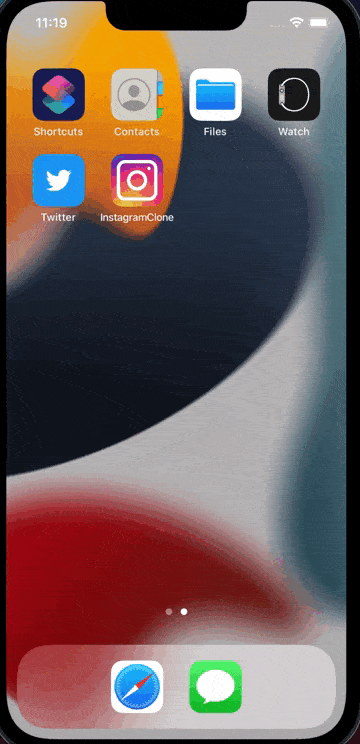

# 3rd Year CS @ UCSB

# Education
  BS in Computer Science, &nbsp; &nbsp; &nbsp; Expected Graduation: June 2025
  
## Skills
#### Programming Languages: C++, Python, JavaScript, Git, Vim, Linux, HTML, CSS, Swift
#### Software/Tools:  Github, Azure DevOps, Xcode, VSCode, Postman

## Work Experience

#### SWE Intern @ Chevron
##### June - September 2023
- Automated testing for APIS, utilizing Postman to remove unnecessary APIs that improves security and reduces complexity by 10 and 15, percent respectively
- Developed newman tests for Azure devops pipeline to ensure proper implementation and results of programs
- Practiced Agile methodology to deliver two projects a week before their expected deadline
- Collaborated using GitHub to branch and promote features

  

#### Early Quantum Computing Intern @ QxQ
##### June - August 2022
- Collaborated with 13 undergraduates implementing quantum algorithms
- Presented applications of algorithms to peers and professionals from 6 partner companies
- Implemented Grover’s Algorithm in Jupyter notebook and found quantum advantage vs classical search algorithms
- Collaborated with Google Quantum AI to advance my quantum computing knowledge

## Projects

#### Mock Instagram App
##### October 2021
- Created a mock Instagram app on Xcode using Swift which replicates features such as Post, Comment, and Scroll Feed
- Exported project to Github to share among classmates
- Implemented APIs to allow the functions of the Instagram app

#### Weather App
##### February 2024
- Created weather app using Swift on Xcode
- Implemented open weather API to forecast weather for next five days
- Changes background display depending on time of day

#### War Card Game App
##### February 2024
- Created War card game using Swift on Xcode
- Compares card values and changes player/CPU score based on comparison
- Changes card values displayed upon click of "Deal" button

## Leadership & Professional Development

#### Career Prep Fellow for Management Leadership for Tomorrow
##### March 2023 - Present
- Responsible for promoting academic development through workshops and study sessions
- Organize mentorship pairings to develop collaboration skills within members
- Overview study room twice a week for eight hours to create a safe space for members to study

#### Academic Chair for SHPE UC Santa Barbara Los Ingenieros 
##### June 2023 - Present
- Responsible for promoting academic development through workshops and study sessions
- Organize mentorship pairings to develop collaboration skills within members
- Overview study room twice a week for eight hours to create a safe space for members to study

#### Google Summit Participant 
##### April - June 2022
- Google Summit for Latinx Students interested in pursuing a career as a Software Engineer
- One of 120 participants selected from a pool of 880 applicants
- Developed connections with students across the country through

## Volunteering

#### Elementary School Science Nights
- Spent two hours volunteering for local elementary schools hosting science nights for their students and parents
- Lead a group of 2-5 SHPE members at 3 different science nights
- Collaborated with over 20 community and university organizations to provide science nights for over 200 students
and parents
- Presented a non-Newtonan fluid(Oobleck) to students and demonstrated its capabalities of both a solid and a liquid

#### Food Bank Volunteer
- Volunteered at a food bank for 3 hours a week in the city of Concord
- Informed of this opportunity through Chevron’s partnership with the Contra Costa Food Bank
- Helped package food for Contra Costa and Solano residents that would eventually serve 1 in 4 residents
